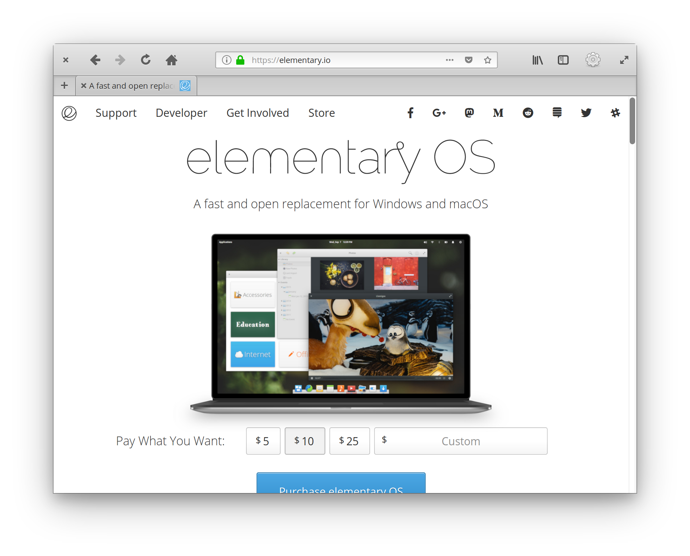

# An elementary Theme for Firefox Quantum

This userChrome.css mimics the [elementary GTK+ theme](https://github.com/elementary/stylesheet) to make firefox blend in better in elementary OS.

## How to use
1. Go to [about:support](about:support) in Firefox
2. Application Basics > Profile Directory > Open Directory
3. Create a folder named `chrome`
4. Paste userChrome.css in this folder
